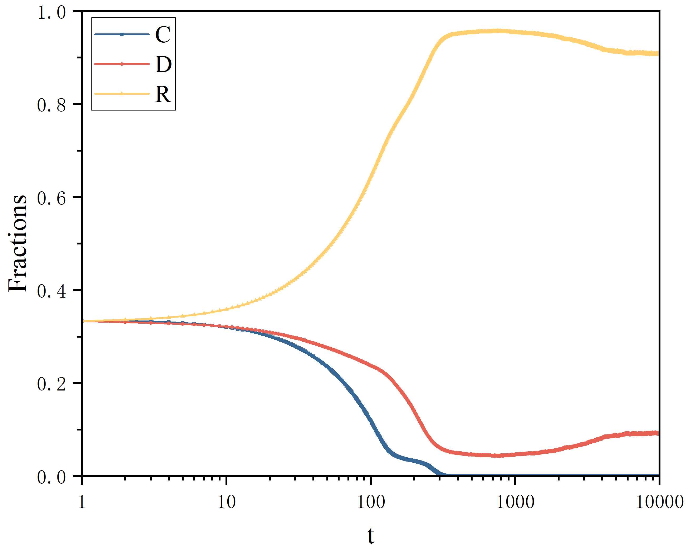

# PGG-with-heterogeneous-tax-and-reward
In recent years, research that introduces tax mechanisms into evolutionary games is very common. However, most studies assume that the tax levy is single and fixed. In fact, the levy and allocation of taxes are often related to the individual’s income, especially they usually enjoy duty-free when the individual’s income is low. Based on this, we consider the heterogeneous tax mechanism and apply it to the traditional reward model of public goods games. Specifically, the higher the individual payoff, the more the tax paid. Furthermore, the taxes received by rewarding cooperators vary depending on the surrounding environment, it can obtain local taxes paid by all individuals in the group, and the average distribution of remaining taxes, i.e., global taxes. After a series of experiments, it is clear that the higher the tax paid by individuals, the more cooperation is promoted. Surprisingly, the variation in the reward cost does not have a major influence on defectors, showing a significant effect only in the competition within the cooperative strategy. After analysis, we observe that defectors remain stable in the population, and individuals with other strategies are rarely changed into defectors. Another important finding is that the smaller the number of rewarding cooperators, the higher payoffs they receive. It is because when rewarding cooperators face unfavorable situations, global tax becomes a key factor in maintaining their survival, ensuring that they are able to persist in the population. Moreover, the robustness of the model on different network sizes is verified. Finally, we also propose an extended model.

This repository hosts the source code of paper of **Cooperative evolution with reward-based heterogeneous tax in spatial public goods games**, which has been submitted to iScience and is under review.

## Requirements
It is worth mentioning that because python runs slowly, we use **numba** library to improve the speed of code running.
* networkx==3.1
* numba==0.57.0
* numpy==1.23.0
* pandas==2.0.2
* scipy==1.11.1
* seaborn==0.12.2
* tqdm==4.65.0

## Setup
The installation of PGG-with-heterogeneous-tax-and-reward is very easy. We've tested our code on Python 3.10 and above. We strongly recommend using conda to manage your dependencies, and avoid version conflicts. Here we show the example of building python 3.10 based conda environment.
****
```
conda create -n reward_tax_based python==3.10.2 -y
conda activate reward_tax_based
pip install -r requirements.txt
```

## Running
```
python reward_tax_based(time).py
```

## Results
The core code of paper is provided here. 'reward_tax_based(time).py' can plot the evolutionary process of various strategies under various parameter settings. Other results in the paper can be obtained by modifying this code. The example  of  results which are obtained from 'reward_tax_based(time).py' are shown below:

<center></center>

## Contact
Please email Huizhen Zhang(zhz943600@gmail.com) or [Jingrui Wang](https://scholar.google.com/citations?user=oiu-yTYAAAAJ&hl=zh-CN)(wangjingrui530@gmail.com)  for further questions.
